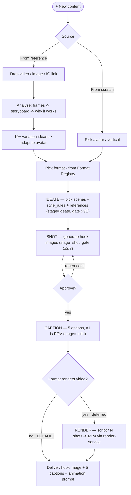
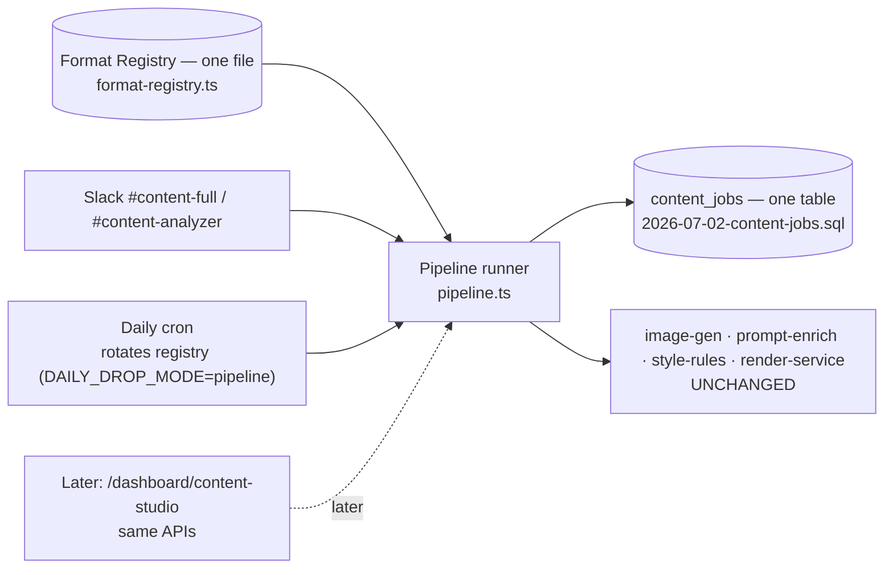
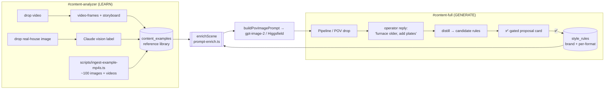
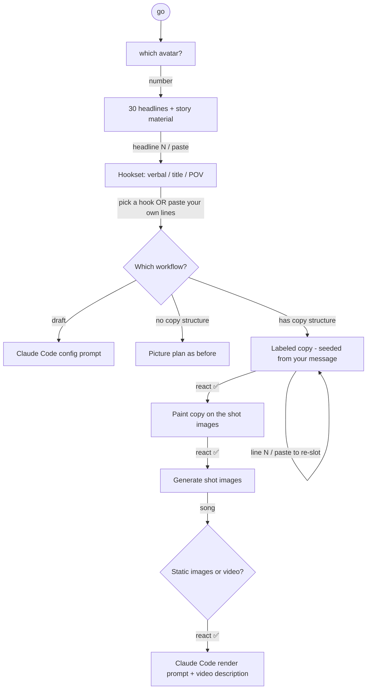

# Content Engine — Blueprint / Mind-Map

The whole SRT content-creation system as it runs through Slack today, mapped so we can see
every workflow, its trigger, its variables, and its data model in one place. This is the
**footprint for productizing** it into a standalone chat-UI app (see [Future App](#future-app-spec)).

> All code lives in `srt-mission-control`. Slack is the current UI: three channels
> (`#content`, `#content-full`, `#content-analyzer`) plus a 3x/day cron.

---

## The one pipeline *(Content Engine v2 · 2026-07-02)*

The old mind-map was messy because the **code** was messy: every format was its own file, its
own table, and its own branch in an 80KB Slack router, so a new style meant a new island. v2
collapses that into ONE robotic pipeline that every single-image format flows through. A format
is now a **row in a registry** ([`src/config/format-registry.ts`](../src/config/format-registry.ts)),
not a new file. Adding "jumpscare", "attic B-roll", "wasp removal" = add a row.

Slack, the daily cron, and the future app are all just **front-ends** onto this pipeline. The
generation providers underneath (image-gen, prompt-enrich, style-rules, render-service) do not move.

**Files:** registry [`src/config/format-registry.ts`](../src/config/format-registry.ts) ·
jobs [`src/lib/reel/jobs.ts`](../src/lib/reel/jobs.ts) ·
pipeline [`src/lib/reel/pipeline.ts`](../src/lib/reel/pipeline.ts) ·
copy standard `generateHookCopy` in [`src/lib/reel/captions.ts`](../src/lib/reel/captions.ts) ·
one reaction/thread dispatcher in [`src/app/api/slack/events/route.ts`](../src/app/api/slack/events/route.ts).

**Reaction routing (one path, not ten):** a reaction is looked up in `content_jobs` by the
reacted message ts; the job's `stage` decides what happens (`ideate` → ✅/🚫, `shot` → 1/2/3).

**Formats today (all data):** `attic_broll` (single shot), `attic_jumpscare` (single shot,
animal lunges at camera). More = more rows.

> Legacy note: the per-format modules (`pov.ts` drop, `pov-studio.ts`, `studio.ts`) and their
> tables still exist and still work; they are ported onto the pipeline one at a time, then
> removed. Bug-Reveal Spray and its 3x/day reel-drop cron were deleted 2026-07-14.

---

## The learning flywheel *(NEW · 2026-07-01)*

The two channels are not separate tools; they feed each other. **#content-analyzer** builds the
reference library and **#content-full** captures the operator's taste as ✅-gated style rules.
Both flow into one **prompt-enrichment** step so each new drop is more realistic than the last.

- **Reference library** (`content_examples`): fed by every analyzed video/image and the one-time
  batch ingest. Read back as visual grounding by `loadReferenceFrames` (image blocks) and as text
  by `loadExampleFewShot`. `reference_house` rows are preferred for realism.
- **Style rules** (`style_rules`): natural-language feedback → distilled → **✅-gated** → active.
  Two-tier: `scope='brand'` applies everywhere, `scope='format'` applies to one format group
  (e.g. `bug_reveal`). Reply `rules` in a drop thread to list the active ones.
- **Enrichment** (`enrichScene`, `prompt-enrich.ts`): the single payoff step. Combines reference
  frames + active rules into a realism-grounded scene at the `buildPovImagePrompt` choke point.
  Empty library + no rules ⇒ byte-identical to the pre-flywheel prompt.

> A live Mission Control dashboard / Miro export of this flywheel (with data tabs for the library
> and the rules) is the next step; today the source of truth is this diagram + the two tables.

---

## Workflow catalog

| Workflow | Channel | Trigger | Entry point | Produces | Key vars / tables |
|---|---|---|---|---|---|
| POV Picker | #content-full | bare image/video post | `lib/reel/pov-studio.ts` `handlePovImagePost` | picker → Render / Animate / Recreate / Caption | `content-workflows.ts` · `pov_studio_jobs`, `pov_rotation` |
| Reel Studio | #content-full | image + copy post | `lib/reel/studio.ts` `handleStudioImage` | 4 script variations → MP4 | `REEL_RENDER_URL/SECRET` · `reel_studio_jobs` |
| IG-link Recreate | #content-full | paste `instagram.com/reel/...` | `pov-studio.ts` `handleInstagramLink` | storyboard + why-it-works + POV remake + first frame | `IG_FRAMES_URL` (derives from `REEL_RENDER_URL`), `YTDLP_COOKIES` |
| Daily Content Ideas | #content-full | cron | `api/cron/daily-content-ideas` | 10 ideas + 30 hooks (text) | `content-ideas-generator.ts` |
| Video Analyzer | #content-analyzer | drop MP4 | `lib/reel/content-analyzer.ts` `analyzeVideo` | shot-by-shot storyboard + POV remake | `VIDEO_FRAMES_URL`, `SLACK_CONTENT_ANALYZER_CHANNEL` |
| Avatar → 30-format calendar | #content-full / #content-analyzer | `generate POV <Vertical> <N> ideas` or kit upload | `api/content/ingest-avatar`, `lib/reel/format-generator.ts` | `verticals` row + ~30 `vertical_formats` | `callClaudeJSON({documents})`, web_search |

---

## Reaction routing (`api/slack/events`)

Reactions self-route by the message ts against each workflow's own table, first match wins:

1. Guardian (`👍/✏️/🚫`) → `handleGuardianReaction`
2. Reel drop headlines (`1/2/3`) → `handleReelReaction`
3. POV ideas gate (`✅/🚫`) → `handlePovIdeasApproval`
4. POV drop pick (`1/2/3`) → `handlePovDropPick`
5. POV workflow (`1/2/3/4`) → `handlePovWorkflowReaction`
8. Reel Studio variations (`1/2/3/4`) → `handleStudioReaction`
9. Generic content → `handleContentReaction` → `handleReactionAdded`

Each returns `false` when no row in its table matches, so the chain is collision-safe.

---

## Avatars, Souls & providers

- **Vargas** — the pest-control POV persona. Trained Higgsfield Soul `8ef82825-7dab-4b87-b7ff-932fceb1fc34`.
  (Known issue: this Soul lives under the Plus/MCP account and returns `character_not_found`
  under the API-billing key. POV images use the **no-character** path or gpt-image-2.)
- **Image providers** (`lib/providers/image-gen.ts`): `higgsfield` (Soul text2image), `openai`
  (gpt-image-2 text2image **and edits**), `elevenlabs` (fallback). POV formats choose via
  `POV_IMAGE_PROVIDER`; the directive is **gpt-image-2 in 3:4** for POV-style images.
- **Sizes**: reels `1152x2048` (9:16), POV `1536x2048` (Higgsfield) / `1024x1536` (gpt-image-2), both 3:4.
- **Verticals** (`config/verticals.ts` + `verticals` table): `pest_control` (homeowner), `pest_owner_ai`
  (B2B, sell owners on content), `mca` (SRT funding). A vertical carries avatar summary, 6 beliefs,
  offer, `style_token`, `gold_examples`, `soul_id`.

---

## Data model (content tables)

| Table | Purpose |
|---|---|
| `reel_rotation` | belief rotation per slot |
| `reel_drops` | belief-drop thread state |
| `reel_studio_jobs` | Reel Studio variations → MP4 |
| `pov_rotation` | recently-used POV scene indices |
| `pov_studio_jobs` | POV picker + daily POV drop state |
| `verticals` | avatar/belief/offer kit per vertical |
| `vertical_formats` | ~30-format difficulty-tagged calendar |
| `content_examples` | labeled storyboard few-shot library |

---

## Future app spec

Goal: lift these workflows out of Slack into a **standalone chat-UI content app** that we own and
can productize. The chat model stays (it is the simplest interface and mirrors Slack), but adds a
canvas.

- **Chat UI (Slack parity)** — same command grammar (`generate POV pest_control 5`,
  drop an image, paste an IG link). Everything that works in Slack works here.
- **Generate image → select a region → "do XYZ here"** — the core new capability. Backed by the
  gpt-image-2 **edits + `mask`** endpoint (`editImage` in `image-gen.ts`): the user draws a box
  on the image (like the red circle + arrow on the reference photo), types an instruction
  ("make bugs pour out of here"), and the masked edit runs on that region only.
- **Workflow library** — every row in the catalog above becomes a pickable card with an example,
  so new formats are added as data, not code (extends the `vertical_formats` model).
- **Vertical/avatar switcher** — pick `pest_control` / `pest_owner_ai` / a new vertical; the whole
  app re-skins its style token, beliefs, gold examples, and Soul.
- **Same Supabase backend** — reuse the existing job tables + `reels` bucket; the app is a new
  front-end over the same engine, so Slack and the app stay in sync.

Build order when we productize: (1) read-only viewer of the catalog + past jobs, (2) chat command
parity, (3) the region-select edit canvas, (4) vertical switcher + workflow-as-data library.

---

## Avatar-first session gate *(2026-07-04)*

The `#content-full` session now asks **which workflow** right after the hooks (copy is asked once),
and a pasted copy block is accepted at the hooks step and seeded into the workflow's labeled boxes.
Full before/after SOP: [SOP-content-workflow-session.md](./SOP-content-workflow-session.md).

