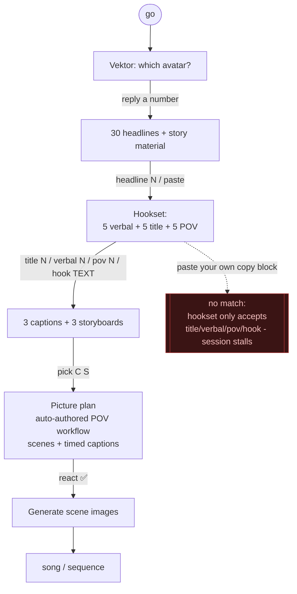
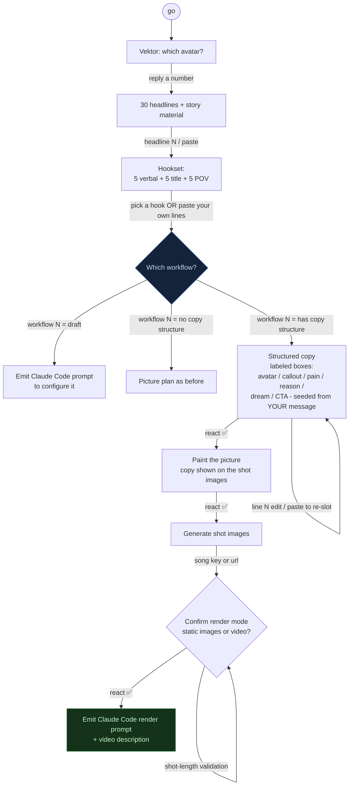

# SOP — Content Workflow Slack Session (Content Engine v3)

How the `#content-full` Vektor session runs. `go` starts it; you drive the whole thing by typing
in the channel (thread replies also work). Heavy generation runs in the background so Slack acks
fast. Two diagrams: how it used to run (and why it stalled), and how it runs now.

Legend: `[box]` = a step Vektor posts. `{diamond}` = a decision. Arrows are what YOU send.

## BEFORE — the old flow (copy asked twice, could stall)

Problems: copy was asked for **twice** (hookset, then captions/storyboards) before any workflow
choice, and pasting your own lines at the hooks step matched no command, so it stalled.

## AFTER — the current flow (workflow asked right after the hooks)

Two fixes: (1) the workflow is asked **immediately after the hooks** (the separate captions/
storyboards step is removed from this path, so copy is asked once); (2) pasting your own copy at
the hooks step now advances the flow and **seeds the labeled copy from your words** (re-slotted
into the boxes), so Vektor gives feedback on your message instead of asking again.

## Command cheat-sheet
- `go` — start (pick an avatar by number, or `new` to create one)
- `headline N` or paste your own headline
- `title N` / `verbal N` / `pov N` / `hook <text>` — pick a hook, **or just paste your copy**
- `workflow N` — pick the workflow to build into
- `line N <text>` — edit one labeled copy box; paste a full block to re-slot it
- `song <key|url>` — set the song (then confirm the render mode)
- `save as <name>` / `save draft` / `modify copy` — when a paste does not match the structure
- `map` / `library` — the workflow inventory
