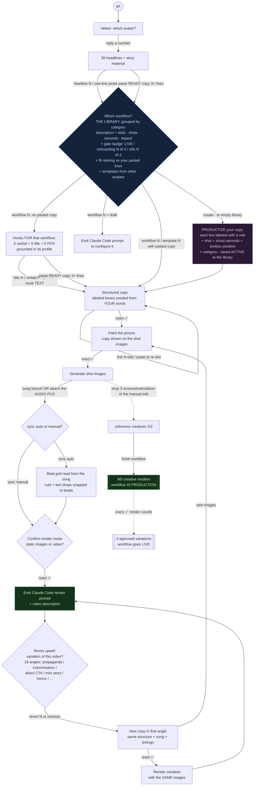

# SOP — Content Workflow Slack Session (Content Engine v3)

How the `#content-full` Vektor session runs. `go` starts it; you drive the whole thing by typing
in the channel (thread replies also work). Heavy generation runs in the background so Slack acks
fast. Two diagrams: how it used to run (and why it stalled), and how it runs now.

Legend: `[box]` = a step Vektor posts. `{diamond}` = a decision. Arrows are what YOU send.

## BEFORE — the old flow (copy asked twice, could stall)

Problems: copy was asked for **twice** (hookset, then captions/storyboards) before any workflow
choice; pasting your own lines at the hooks step matched no command, so it stalled; and a full
copy paste at the headlines step triggered "Building hooks for: <your whole block>".

## AFTER — the current flow (WORKFLOW FIRST, then hooks; paste ready copy anywhere)

Flip (2026-07-03): the workflow is chosen BEFORE any hooks, so the hooks/copy are generated
FOR that workflow, grounded in its description + copy structure + visual rules.

The fixes/features:
1. **Pasting a ready copy block (3+ lines) anywhere skips hook building** and goes straight to
   the workflow question. Blocks starting with "POV:" or a number no longer stall the session.
2. **The workflow question is the library**: grouped by category with slots/shots/seconds/aspect
   labels, a fit ranking against your pasted line count, cross-avatar templates, and `create`.
3. **`create` productizes your copy on the spot**: exact words kept, each line labeled with a
   role (avatar / pain callout / reason / dream / CTA...), timed and placed on the 9:16 frame
   (3:4 for Meta-glasses POV), category assigned, saved as an ACTIVE workflow — same structure,
   different copy next time. An empty library auto-creates without asking.
4. **Attach the audio file in Slack** to set the workflow's song; `sync auto` reads its beat grid
   (render-service `analyze-song`) and snaps shot cuts + text drops to the beat.
5. **Production gate**: drop 3 reference creatives (screenshots of your manual edit, videos,
   the audio) in the session thread, then `finish workflow` renders the 4th and marks the
   workflow IN PRODUCTION. `map` shows all of it as a rendered image.
6. **Onboarding to LIVE**: once in production, every ✅-approved render (base or remix) counts
   as an approved variation; at 4 the workflow flips LIVE. The variations double as the
   examples gallery on `/dashboard/content-workflows/<id>`.
7. **Consistency profile**: each workflow carries a one-line description + visual rules that
   ground every hook, copy line, and scene image prompt. Edit them (plus per-shot prompts,
   image model, aspect, quality, song, timings) on the workflow's dashboard editor page —
   click any card on the Content Studio board.
8. **Image/motion models**: ALL images generate with the GPT image model via the Higgsfield key
   (slug `openai/hazel`); ALL animation runs Seedance via Higgsfield. Per-workflow override:
   `render_options.provider`.

## Command cheat-sheet
- `go` — start (pick an avatar by number, or `new` to create one)
- `headline N` or paste your own headline (one line)
- **paste your READY copy (3+ lines)** — anywhere after the avatar: jumps to the workflow library
- `title N` / `verbal N` / `pov N` / `hook <text>` — pick a hook
- `workflow N` — use a workflow (your pasted copy gets slotted into its boxes)
- `template N` — same, explicitly: re-slot YOUR copy into its structure (cross-avatar picks clone first)
- `create` / `new workflow` — productize your pasted copy into a NEW saved workflow
- `line N <text>` — edit one labeled copy box; paste a full block to re-slot it
- `idea N` (✅ = idea 1) — pick a visual direction at the ideas gate (posts after copy ✅, BEFORE any image generates)
- `more ideas` / `more hooks` — redraw the 3 directions, or back up for fresh hook options
- `song <key|url>` or **attach the audio file** — set the song
- `sync auto` / `sync manual` — snap the timeline to the song's beat, or keep your timings
- drop screenshots/videos in the thread — reference creatives (3 needed)
- `finish workflow` — render the 4th creative and mark the workflow IN PRODUCTION
- `remix N` / `remixes` — after a render: 16 narrative variations (propaganda, indoctrination, direct CTA, mini story, horror, testimonial, myth bust, us-vs-them, insider secret, stat shock, before/after, objection killer, seasonal FOMO, authority, relatable, dream outcome) of the same workflow + song; ✅ renders with the same images, `new images` regenerates creatives from the new copy
- `save as <name>` / `save draft` / `modify copy` — when a paste does not match the structure
- `map` / `library` (optionally `map <avatar>`) — the library as a labeled image
